# 📊 Palmyra Store - Database Schema Diagram (v1.1)

## مخطط العلاقات الكامل (ER Diagram)

```mermaid
erDiagram
    roles {
        INT_UNSIGNED id PK
        VARCHAR name UK "admin, employee"
        VARCHAR display_name
        TEXT description
    }

    permissions {
        INT_UNSIGNED id PK
        VARCHAR name UK "products.create"
        VARCHAR display_name
        VARCHAR module
    }

    role_permissions {
        INT_UNSIGNED role_id PK,FK
        INT_UNSIGNED permission_id PK,FK
    }

    admin_users {
        INT_UNSIGNED id PK
        VARCHAR full_name
        VARCHAR username UK
        VARCHAR password_hash
        INT_UNSIGNED role_id FK
        ENUM status "active/inactive/suspended"
        TIMESTAMP last_login_at
    }

    customers {
        INT_UNSIGNED id PK
        VARCHAR name
        VARCHAR email UK
        VARCHAR phone UK
        VARCHAR password_hash
        VARCHAR governorate
        ENUM status "active/blocked"
        INT orders_count
        DECIMAL total_spent
    }

    categories {
        INT_UNSIGNED id PK
        VARCHAR name
        VARCHAR slug UK
        INT_UNSIGNED parent_id FK "self-ref"
        TINYINT level "0/1/2"
        VARCHAR image
        INT sort_order
        TINYINT is_active
        TIMESTAMP deleted_at "soft delete"
    }

    brands {
        INT_UNSIGNED id PK
        VARCHAR name
        VARCHAR slug UK
        CHAR letter
        VARCHAR image
        TINYINT is_active
        TIMESTAMP deleted_at "soft delete"
    }

    skin_types {
        INT_UNSIGNED id PK
        VARCHAR name
        VARCHAR image
        TINYINT is_active
    }

    products {
        INT_UNSIGNED id PK
        VARCHAR name
        VARCHAR slug UK
        TEXT description
        DECIMAL price
        DECIMAL old_price
        DECIMAL cost_price
        INT_UNSIGNED quantity
        VARCHAR sku UK
        INT_UNSIGNED category_id FK
        INT_UNSIGNED sub_category_id FK
        INT_UNSIGNED inner_category_id FK
        INT_UNSIGNED brand_id FK
        INT_UNSIGNED skin_type_id FK
        VARCHAR size
        VARCHAR volume
        TINYINT is_new
        TINYINT is_sale
        TINYINT is_active
        INT_UNSIGNED views_count
        TIMESTAMP deleted_at "soft delete"
    }

    product_images {
        INT_UNSIGNED id PK
        INT_UNSIGNED product_id FK
        VARCHAR image_url
        TINYINT sort_order
        TINYINT is_primary
    }

    orders {
        INT_UNSIGNED id PK
        VARCHAR order_number UK
        INT_UNSIGNED customer_id FK
        VARCHAR customer_name "snapshot"
        DECIMAL subtotal
        DECIMAL delivery_fee
        DECIMAL total
        INT_UNSIGNED currency_id FK
        ENUM payment_method
        VARCHAR transfer_proof
        ENUM verification_status
        ENUM status "8 states"
        TIMESTAMP paid_at
        TIMESTAMP delivered_at
    }

    order_items {
        INT_UNSIGNED id PK
        INT_UNSIGNED order_id FK
        INT_UNSIGNED product_id FK
        VARCHAR product_name "snapshot"
        INT_UNSIGNED quantity
        DECIMAL unit_price
        DECIMAL total_price
    }

    offers {
        INT_UNSIGNED id PK
        INT_UNSIGNED product_id FK
        ENUM discount_type "percentage/fixed"
        DECIMAL discount_value
        DATE start_date
        DATE end_date
        TINYINT is_active
    }

    banners {
        INT_UNSIGNED id PK
        TINYINT position UK "0/1/2"
        VARCHAR image
        VARCHAR link
        VARCHAR title
        TINYINT is_active
    }

    notifications {
        INT_UNSIGNED id PK
        ENUM type "system/order/promotion/admin"
        ENUM recipient_type
        INT_UNSIGNED recipient_id
        VARCHAR title
        TEXT body
        TINYINT is_read
        INT_UNSIGNED related_order_id FK
    }

    currencies {
        INT_UNSIGNED id PK
        VARCHAR name
        VARCHAR code UK "SAR/USD"
        VARCHAR symbol
        DECIMAL exchange_rate
        TINYINT is_default
        TINYINT is_active
    }

    store_settings {
        INT_UNSIGNED id PK
        VARCHAR setting_key UK
        TEXT setting_value
        ENUM setting_type
        VARCHAR description
    }

    carts {
        INT_UNSIGNED id PK
        INT_UNSIGNED customer_id FK,UK
    }

    cart_items {
        INT_UNSIGNED id PK
        INT_UNSIGNED cart_id FK
        INT_UNSIGNED product_id FK
        INT_UNSIGNED quantity
    }

    roles ||--|{ role_permissions : "has"
    permissions ||--|{ role_permissions : "granted_to"
    roles ||--|{ admin_users : "assigned_to"

    customers ||--o{ orders : "places"
    customers ||--|| carts : "owns"
    orders ||--|{ order_items : "contains"
    products ||--o{ order_items : "sold_in"

    categories ||--o{ categories : "parent_of"
    categories ||--o{ products : "main_cat"
    categories ||--o{ products : "sub_cat"
    categories ||--o{ products : "inner_cat"
    brands ||--o{ products : "branded"
    skin_types ||--o{ products : "suitable_for"
    products ||--|{ product_images : "has_images"
    products ||--o{ offers : "discounted"
    products ||--o{ cart_items : "in_cart"
    carts ||--|{ cart_items : "contains"

    currencies ||--o{ orders : "priced_in"
    orders ||--o{ notifications : "triggers"
```

---

## ملخص الجداول والعلاقات

### 🔐 نظام الصلاحيات
| من | العلاقة | إلى | نوع FK |
|----|---------|-----|--------|
| `admin_users.role_id` | → | `roles.id` | RESTRICT |
| `role_permissions.role_id` | → | `roles.id` | CASCADE |
| `role_permissions.permission_id` | → | `permissions.id` | CASCADE |

---

### 📦 كتالوج المنتجات
| من | العلاقة | إلى | نوع FK |
|----|---------|-----|--------|
| `categories.parent_id` | → | `categories.id` | CASCADE (self-ref) |
| `products.category_id` | → | `categories.id` | SET NULL |
| `products.sub_category_id` | → | `categories.id` | SET NULL |
| `products.inner_category_id` | → | `categories.id` | SET NULL |
| `products.brand_id` | → | `brands.id` | SET NULL |
| `products.skin_type_id` | → | `skin_types.id` | SET NULL |
| `product_images.product_id` | → | `products.id` | CASCADE |

---

### 🛒 الطلبات والسلة
| من | العلاقة | إلى | نوع FK |
|----|---------|-----|--------|
| `orders.customer_id` | → | `customers.id` | RESTRICT |
| `orders.currency_id` | → | `currencies.id` | RESTRICT |
| `order_items.order_id` | → | `orders.id` | CASCADE |
| `order_items.product_id` | → | `products.id` | SET NULL |
| `carts.customer_id` | → | `customers.id` | CASCADE |
| `cart_items.cart_id` | → | `carts.id` | CASCADE |
| `cart_items.product_id` | → | `products.id` | CASCADE |

---

### 🏷️ العروض والإشعارات
| من | العلاقة | إلى | نوع FK |
|----|---------|-----|--------|
| `offers.product_id` | → | `products.id` | CASCADE |
| `notifications.related_order_id` | → | `orders.id` | SET NULL |

---

## CHECK Constraints

| الجدول | القيد | الوصف |
|--------|-------|-------|
| `categories` | `chk_cat_level_parent` | level=0 يتطلب parent_id=NULL والعكس |
| `offers` | `chk_offer_dates` | end_date >= start_date |
| `banners` | `chk_banner_position` | position IN (0, 1, 2) |

---

## Soft Delete

| الجدول | الحقل | الاستخدام |
|--------|-------|----------|
| `products` | `deleted_at` | `WHERE deleted_at IS NULL` في كل الاستعلامات |
| `categories` | `deleted_at` | `WHERE deleted_at IS NULL` في كل الاستعلامات |
| `brands` | `deleted_at` | `WHERE deleted_at IS NULL` في كل الاستعلامات |

---

## ملف SQL الكامل

[palmyra_store_schema.sql](file:///d:/%D8%A8%D8%A7%D9%84%D9%85%D9%8A%D8%B1%D8%A7%20%D8%B3%D8%AA%D9%88%D8%B1/database/palmyra_store_schema.sql) — **19 جدول | 16 FK | 20+ Index | 3 Views**
